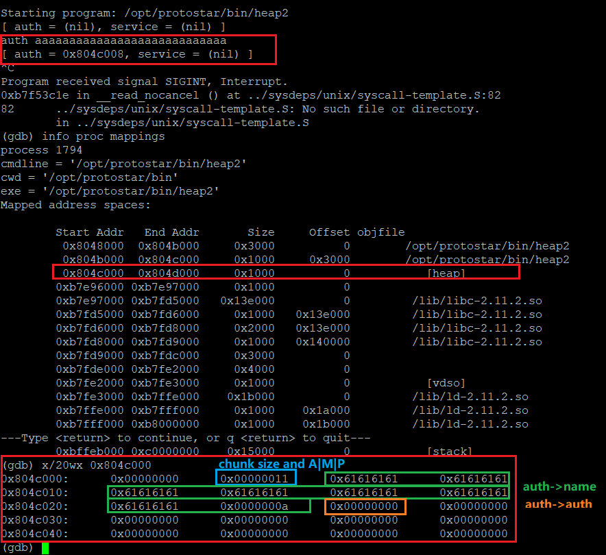

# 0x16 The Heap: How do use-after-free exploits work
> 堆利用 use-after-free 
- **漏洞代码**
  ```c
  #include <stdlib.h>
  #include <unistd.h>
  #include <string.h>
  #include <sys/types.h>
  #include <stdio.h>
  // 定义 auth 结构体
  struct auth {
    char name[32];
    int auth;
  };

  struct auth *auth;
  char *service;

  int main(int argc, char **argv)
  {
    char line[128];

    while(1) {
  
      printf("[ auth = %p, service = %p ]\n", auth, service);
      // 输入存储在 line 变量中
      if(fgets(line, sizeof(line), stdin) == NULL) break;
      // 判断输入是否为 "auth"     
      if(strncmp(line, "auth ", 5) == 0) {
        // 给变量分配空间并赋值为0
        auth = malloc(sizeof(auth));
        memset(auth, 0, sizeof(auth));
        // 控制用户输入的 auth 大小 < 31
        if(strlen(line + 5) < 31) {
          // 将输入赋值到堆区
          strcpy(auth->name, line + 5);
        }
      }
      // 释放堆区 auth 
      if(strncmp(line, "reset", 5) == 0) {
        free(auth);
      }
      // 判断输入是否为 "service"
      if(strncmp(line, "service", 6) == 0) {
        // 获取 "service" 输入
        service = strdup(line + 7);
      }
      if(strncmp(line, "login", 5) == 0) {
        // 若 auth -> auth 不为0，则成功登录
        if(auth->auth) {
          printf("you have logged in already!\n");
        } else {
          printf("please enter your password\n");
        }
      }
    }
  }
  ```
- malloc chunk结构
  - 已被分配的非空闲 chunk
      ```txt
      chunk-> +-+-+-+-+-+-+-+-+-+-+-+-+-+-+-+-+-+-+-+-+-+-+-+-+-+-+-+-+-+-+-+-+
              |             Size of previous chunk, if unallocated (P clear)  |
              +-+-+-+-+-+-+-+-+-+-+-+-+-+-+-+-+-+-+-+-+-+-+-+-+-+-+-+-+-+-+-+-+
              |             Size of chunk, in bytes                     |A|M|P|
      mem-> +-+-+-+-+-+-+-+-+-+-+-+-+-+-+-+-+-+-+-+-+-+-+-+-+-+-+-+-+-+-+-+-+
              |     User data starts here.. (malloc分配时指针指向,mem指针)     |
              .                                                               .
              .             (malloc_usable_size() bytes)                      .
      next    .                                                               |
      chunk-> +-+-+-+-+-+-+-+-+-+-+-+-+-+-+-+-+-+-+-+-+-+-+-+-+-+-+-+-+-+-+-+-+
              |             (size of chunk, but used for application data)    |
              +-+-+-+-+-+-+-+-+-+-+-+-+-+-+-+-+-+-+-+-+-+-+-+-+-+-+-+-+-+-+-+-+
              |             Size of next chunk, in bytes                |A|0|1|
              +-+-+-+-+-+-+-+-+-+-+-+-+-+-+-+-+-+-+-+-+-+-+-+-+-+-+-+-+-+-+-+-+
      ```
  - 空闲 chunk 结构
      ```txt
      chunk-> +-+-+-+-+-+-+-+-+-+-+-+-+-+-+-+-+-+-+-+-+-+-+-+-+-+-+-+-+-+-+-+-+
              |             Size of previous chunk, if unallocated (P clear)  |
              +-+-+-+-+-+-+-+-+-+-+-+-+-+-+-+-+-+-+-+-+-+-+-+-+-+-+-+-+-+-+-+-+
      `head:' |             Size of chunk, in bytes                     |A|0|P|
      mem-> +-+-+-+-+-+-+-+-+-+-+-+-+-+-+-+-+-+-+-+-+-+-+-+-+-+-+-+-+-+-+-+-+
              |             Forward pointer to next chunk in list             |
              +-+-+-+-+-+-+-+-+-+-+-+-+-+-+-+-+-+-+-+-+-+-+-+-+-+-+-+-+-+-+-+-+
              |             Back pointer to previous chunk in list            |
              +-+-+-+-+-+-+-+-+-+-+-+-+-+-+-+-+-+-+-+-+-+-+-+-+-+-+-+-+-+-+-+-+
              |             Unused space (may be 0 bytes long)                .
              .                                                               .
      next   .                                                               |
      chunk-> +-+-+-+-+-+-+-+-+-+-+-+-+-+-+-+-+-+-+-+-+-+-+-+-+-+-+-+-+-+-+-+-+
      `foot:' |             Size of chunk, in bytes                           |
              +-+-+-+-+-+-+-+-+-+-+-+-+-+-+-+-+-+-+-+-+-+-+-+-+-+-+-+-+-+-+-+-+
              |             Size of next chunk, in bytes                |A|0|0|
              +-+-+-+-+-+-+-+-+-+-+-+-+-+-+-+-+-+-+-+-+-+-+-+-+-+-+-+-+-+-+-+-+
      ```
    **chunk_head.size = 用户区域大小 + 2 * 字长**
- **GDB 调试**
  > 最终的目的是可登录，需要使得 auth->auth 不为0，但是没有直接针对 auth->auth 的操作
  - 首先，分别进行 `auth`、`service`、`reset` 操作，查看堆区变化
    - 首先，进行 ```auth aaaaaaaaaaaaaaaaaaaaaaaaaaaaa``` 
      
    - 然后进行 ```service bbbbbbbbbb```
      可以发现，`auth` 区域被覆盖，这个时候返回去看 `auth`堆的大小，发现只有 8 byte（结合堆结构分布，`chunk size = 2 * 字长 + use data space `，32位程序字长为 `32bit = 4byte`，因此用户区域为 `0x10 byte - 4 * 2 byte = 16 - 8 = 8 byte`， 因此，在计算 `service` 堆起始位置后，会将 `auth` 堆区覆盖，因此存在堆溢出。
      
    - 最后进行 `reset` 操作，首先，虽然释放的 auth，但是auth 指针仍然指向 `0x804c008`，并且，根据空闲 chunk 分析，只有第一个 `0x61616161` 变成 `0x00000000`，因为空闲 chunk 需要指定 `Forward pointer to next chunk in list` 和 `Back pointer to previous chunk in list`，其余部分并未清空，这些都体现出可能存在 **`user-after-free`** 漏洞
      
- **漏洞利用**
  根据程序，`auth->auth` 应该在 auth 堆偏移32个字节处，如下图
  
  利用堆溢出，使用 service 对 `auth->auth` 进行覆盖
  
  直接执行程序
  
## 参考链接
- [exploit-protostar](https://exploit.education/protostar/) 
- [liveoverflow_binary-hacking](https://www.youtube.com/channel/UClcE-kVhqyiHCcjYwcpfj9w)
- [heap overflow ctf-wiki](https://ctf-wiki.org/pwn/linux/user-mode/heap/ptmalloc2/heapoverflow-basic/)