# 0x17 The Heap: Once upon a free() & 0x18 The Heap dlmalloc unlink() exploit
> 堆利用 unlink & GOT 覆盖
- **源代码**
  ```c
  #include <stdlib.h>
  #include <unistd.h>
  #include <string.h>
  #include <sys/types.h>
  #include <stdio.h>

  void winner()
  {
    printf("that wasn't too bad now, was it? @ %d\n", time(NULL));
  }

  int main(int argc, char **argv)
  {
    char *a, *b, *c;

    a = malloc(32);
    b = malloc(32);
    c = malloc(32);

    strcpy(a, argv[1]);
    strcpy(b, argv[2]);
    strcpy(c, argv[3]);

    free(c);
    free(b);
    free(a);

    printf("dynamite failed?\n");
  }
  ```
  实现的效果为需要执行 winner()，代码中存在危险函数调用时为进行长度限制。
- GDB 调试
  - 首先，对执行过程中对 `malloc()`、`free()`、`strcpy()`、`printf()` 函数调用进行断点调试，查看过程中堆区变化。（gdb下可用bins、heap 查看 chunk 及 空闲 chunk 链表，但是此二进制程序无法查看）
    - malloc 分配堆区变化
      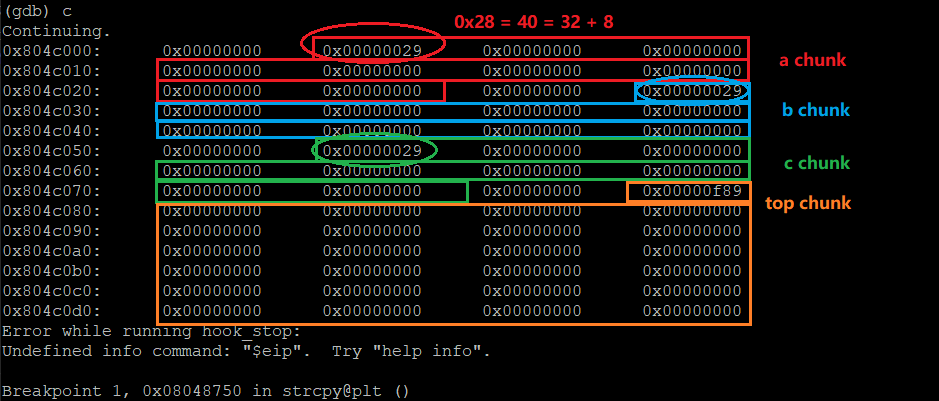
    - strcpy 执行之后
      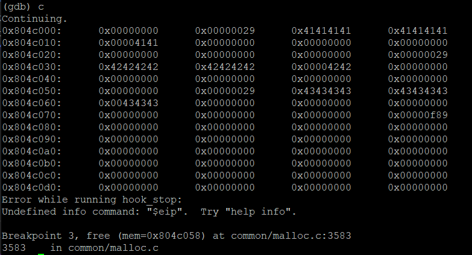
      若输入超长字符串，则可将其它 `chunk()` 的 `chunk head()` 进行覆盖。但是如果除了需要覆盖之外，还需要考虑如何能够执行。这里，还是希望能通过对堆中数据的覆盖，可以获取函数的控制流，如，覆盖 GOT 的 `printf()` 地址，使得调用 printf 时实际调用的是 `winner()`
    - free 释放堆区变化
      - `free(c);`
      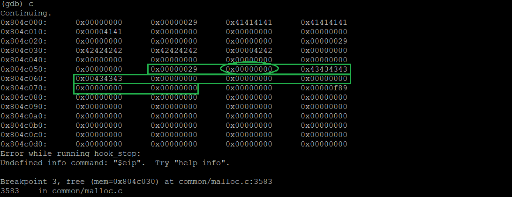
      - `free(b);`
      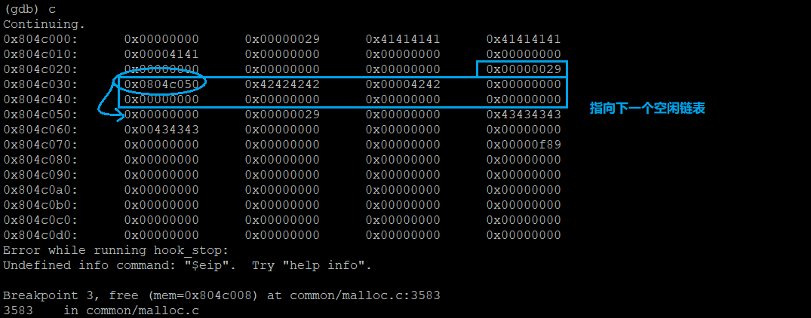
      - `free(a);`
      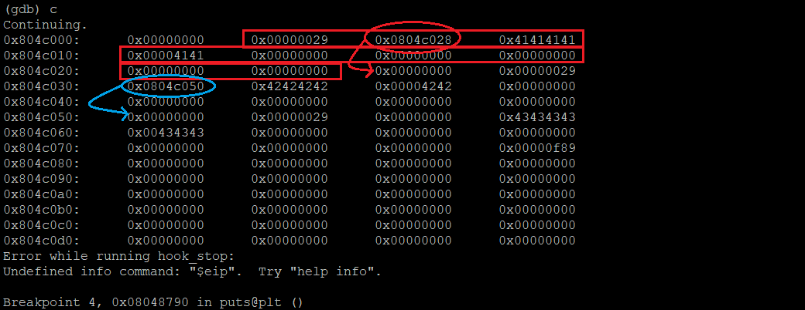
      由此，可以看到，在释放大小为32byte的堆时，实际上生成的空闲链表，对应 [malloc.c](../malloc.c)代码如下
      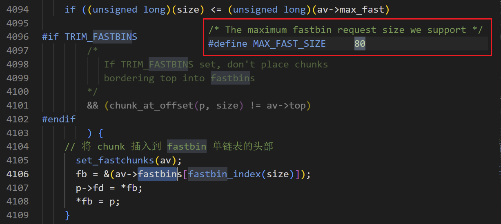
      **当 chunk 块大小 < 80 byte 时，会将空闲块回收到 faskbin 单链表中，再分配时使用 LIFO（后进先出）**
      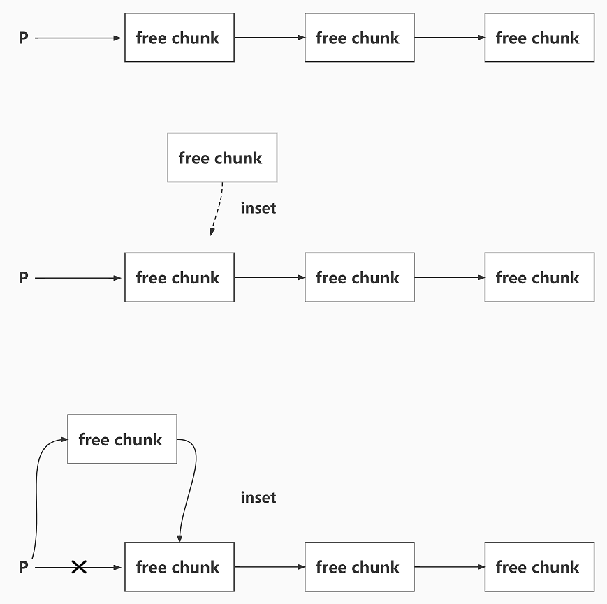
      这里只有一个指针变化，无法完成指向指定地址并修改地址存储数据，固无法达到覆盖 GOT 的 `printf()` 地址，使得调用 printf 时实际调用的是 `winner()`效果
  - 通过阅读 [malloc.c](../malloc.c) 并直接通过 gdb 修改堆区数据的方式，尝试覆盖 printf GOT 表中对应地址的存储数据为 winner 函数地址
    - chunk 合并时会执行 unlink 操作，阅读代码，发现会合并前后两个 free chunk（后续补充修正，何时会使用unlink）
       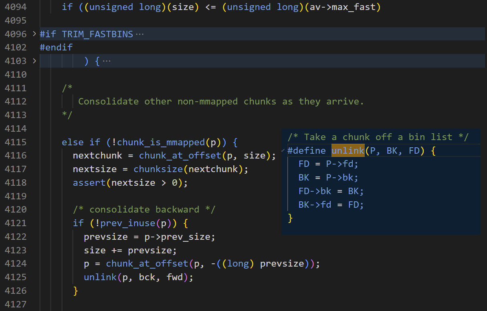
       贴上作者生动图解:beer:
       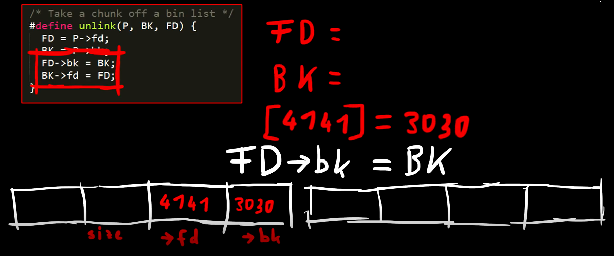
       这里的操作是将待合并的 chunk 的前一个 chunk 的 fd 指针赋值给待前一个 chunk 的 bk 指针指向的 chunk 的 fd 指针，待合并的 chunk 的前一个 chunk 的 bk 指针赋值给待前一个 chunk 的 fd 指针指向的 chunk 的 bk 指针。因此，这里**有可指定地址并修改的操作**。
    - 若将 `FD->bk` 覆盖为 printf GOT 地址，将 `BK` 覆盖为 winner 地址，即可完成操作，但是后续还有 `BK->fd = FD`，若 BK 指向的是 winner 地址，代码段只可读不可写，尝试修改会造成 segment fault，因此，不可直接进行修改。作者这里的解决办法为，使用 heap。:beers:
    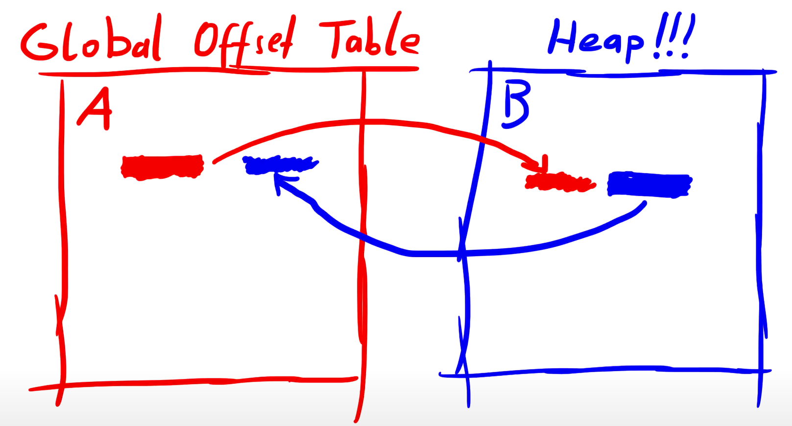
    - 直接修改堆中数据
      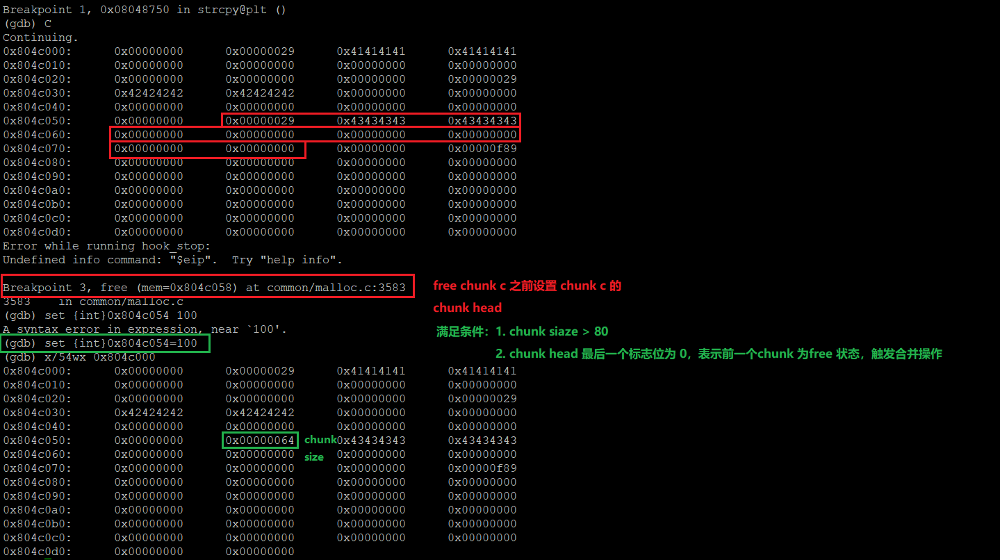
      根据[malloc.c](../malloc.c)，程序会根据 pre_size 计算前一相邻空闲 chunk 的指针，因此改变 pre_size。
      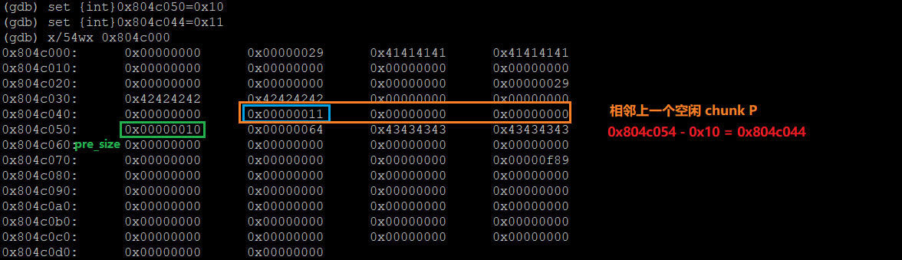
      构造前一个相邻空闲块的 `fd` 指针和 `bk` 指针
      - puts@Global 地址
        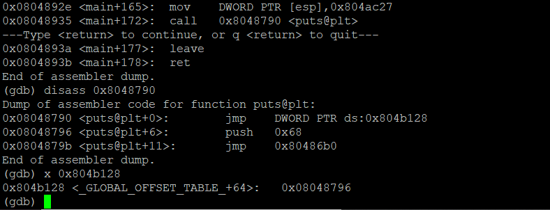
      - 覆盖 `P->fd` 为 `0x804b11c`
        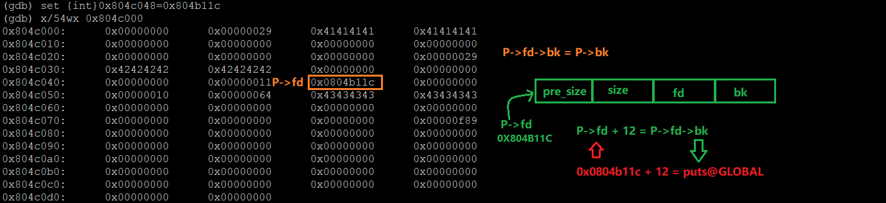
      - 覆盖 `P->bk` 为 `0x804c010`
    - 执行 `free` 操作，可以看到，虽然 `puts@GLOBAL` 已被覆盖为指定值，但是程序 `segment fault` 异常
      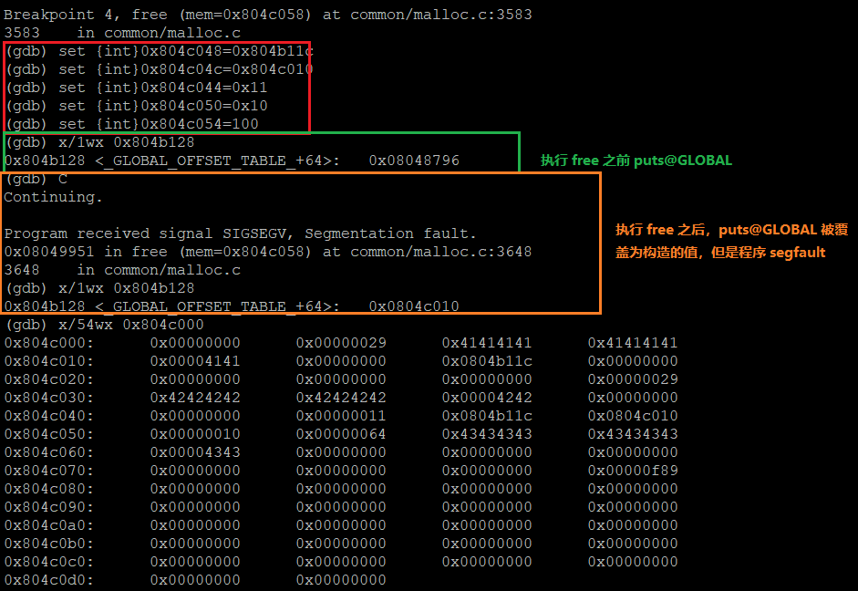
      查看 [malloc.c](../malloc.c)
      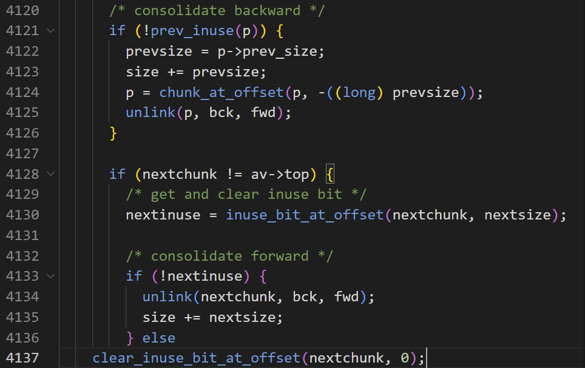
      可以看到，在进行 4125 行 unlink 后，会判断 nextchunk 是否为 top chunk，如果不是，会判断 nextchunk 是否处于空闲状态，若为空闲状态，则会进一步执行 unlink 操作。因此，此处需要构造一个非空闲块，阻止进入 4134 行 unlink
      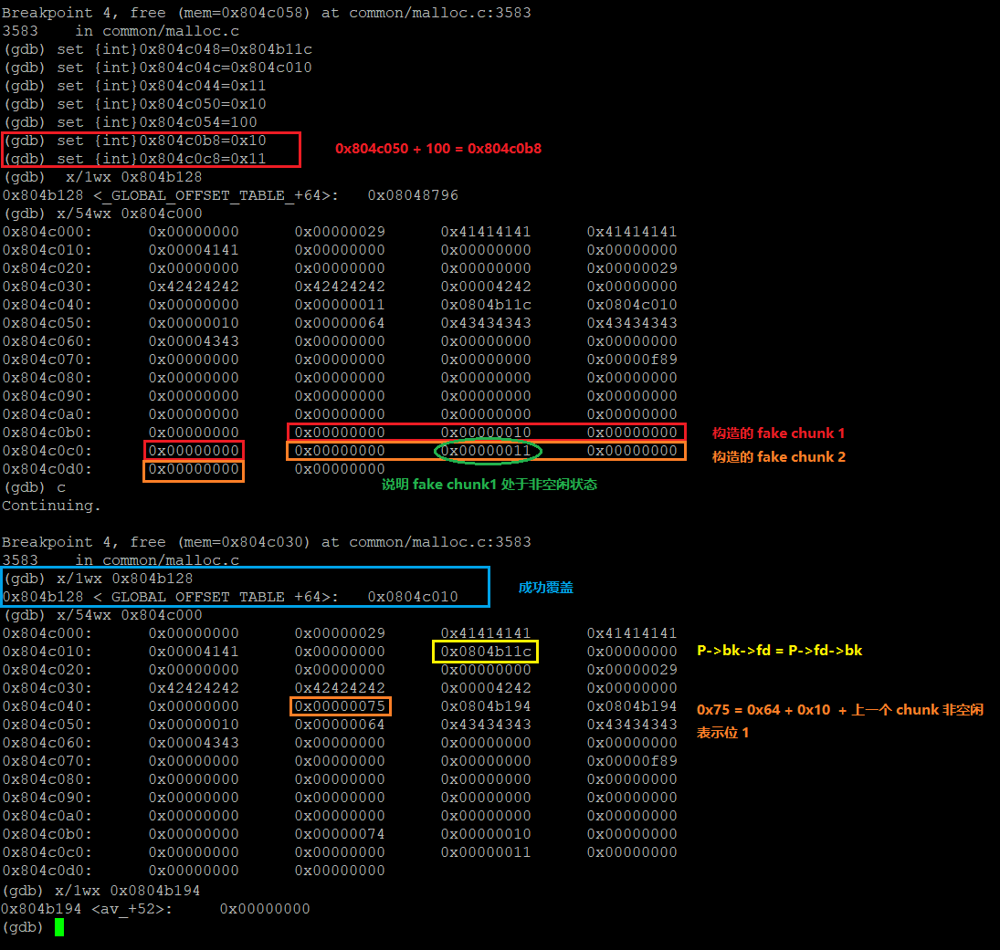
....未完待续:busstop:
    

<!-- set {int}0x804c048=0x804b11c
set {int}0x804c04c=0x804c010
set {int}0x804c044=0x11
set {int}0x804c050=0x10
set {int}0x804c054=100
set {int}0x804c0b8=0x10
set {int}0x804c0c8=0x11
set {int}0x804c0cc=0x804c080
set {int}0x804c0d0=0x804c090 -->

        
